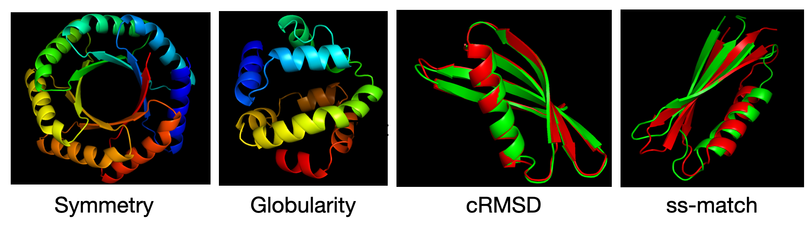

## Description 

This repository contains the code accompanying our paper in XXX. We propose a method that integrates pre-trained discrete diffusion models (e.g., [EvoDiff](https://github.com/microsoft/evodiff)) for protein sequences with reward models (i.e., seq → target property) at test time for computational protein design. **Our algorithm effectively optimizes the reward function while retaining sequence naturalness characterzied by pre-trained diffusion models**. Unlike existing single-shot guided approaches in diffusion models, our method uses an **iterative refinement** approach inspired by evolutionary algorithms, alternating between (derivative-free) reward-guided denoising and noising. 

<p align="center">
  
</p>

Below are examples of trajectories obtained when optimizing structural properties as rewards

<p align="center">
  
  
</p>


#### Generated Proteins 

We present results on optimizing several fundamental structural rewards, including ``symmetry``, ``globularity``, ``match_ss``, ``crmsd``.  We can further optimize ``ptm``,``plddt``,``tm``,``lddt``,``hydrophobic``,``surface_expose``. All rewards are defined based on the outputs of a sequence-to-structure model using ESMFold. Below, we visualize examples of the generated sequences, where ESMFold is used to predict their structures.

<p align="center">
  
</p>


----

## Instructions for Running the Code

```
CUDA_VISIBLE_DEVICES=0 python refinement.py
```
Run the above command with additional options. Below is an explanation of the available options. 

* ``--decoding``: decoding method e.g., SVDD_edit (our proposal in the paper), SVDD (single-shot generation)
* ``--repeatnum``: batch size  
* ``--duplicate``: important hyperparameters in decoding methods for each cycle. It reflects how many states we replicate (e.g., 20). This is the width of the tree (Refer to [SVDD](https://arxiv.org/abs/2408.08252s)).  
* ``--metrics_name``: reward function. We have ``tm``, ``globularity``, ``plddt``, ``ptm``, ``hydrophobic``, ``symmetry``, ``globularity``, ``match_ss``, ``crmsd``, ``ptm``,``plddt``,``tm``,``lddt``,``hydrophobic``,``surface_expose``. 
* ``--metrics_list``: how to set weights for the above rewards. For example, ``--metric_name match_ss,crmsd,plddt --metrics_list 1,1,1`` means we optimize ``match_ss + crmsd + plddt``. 
* ``--proteinname``: In tasks such as ``match_ss``, ``crmsd``, ``tm``, we can set some target structure in a pdb format in the folder ``./datasets/AlphaFold_model_PDBs`` (e.g., 5KPH, XX:run1_0367_0004, etc.) 
* ``--iteraiton``: number of iterations in our proposal (e.g., 20)
* ``--seq_length``: length of proteins we want to design 
*  ``--edit_seqlength``: How much portion of the sequence we edit (e.g., 0.5$)  


#### 1. Symmetry 

Design symmetric proteins with sevenfold symmetry.

```
CUDA_VISIBLE_DEVICES=3 python refinement.py --decoding SVDD_edit  --repeatnum 10 --duplicate 20 --seq_length 30 --metrics_name symmetry,hydrophobic,plddt --metrics_list 1,1,1 --iteration 20 --num_symmetry 7
```

#### 2. Globularity 

Design globular proteins. 

```
CUDA_VISIBLE_DEVICES=2 python refinement.py --decoding SVDD_edit  --repeatnum 10 --duplicate 20  --metrics_name globularity,plddt  --metrics_list 1,1 --iteration 20 --seq_length 150
```

#### 3. cRMSD 

Design a sequence that folds into a target structure based on cRMSD. 

```
CUDA_VISIBLE_DEVICES=3 python refinement.py --decoding SVDD_edit  --repeatnum 20 --duplicate 20  --metrics_name crmsd  --metrics_list 1 --proteinname 5KPH --iteration 40
```

#### 4. SS (secondary structure) match

Design a sequence that folds into a target secondary structure.

```
CUDA_VISIBLE_DEVICES=4 python refinement.py --decoding SVDD_edit  --repeatnum 10 --duplicate 20  --metrics_name match_ss  --metrics_list 1 --proteinname r15_96_TrROS_Hall --iteration 30
```

#### 5. TM score 


Design a sequence that folds into a target structure based on the TM-score. 

```
CUDA_VISIBLE_DEVICES=5 python refinement.py --decoding SVDD_edit  --repeatnum 10 --duplicate 20  --metrics_name tm  --metrics_list 1 --proteinname 5KPH --iteration 30
```

----

### Editting Sequences 

When we want to edit existing sequences, set ``--seed_design`` as ``True``, and ``--initial_seq`` as a protein sequence. The following is an example when optimizing symmetry. 

```
CUDA_VISIBLE_DEVICES=6 python refinement.py --decoding SVDD_edit  --repeatnum 10 --duplicate 20 --metrics_name crmsd,plddt,hydrophobic --proteinname r15_96_TrROS_Hall --metrics_list 1,1,1 --iteration 20 --seed_design True --initial_seq MMELEIEIKVEGMTEEELRELAERLAAELTPEGWKVVAVRVERVDEEEGVVRVTVVVEPV  
```

### Outputs 

Refer to the notebook ```medias/evaluate.ipynb```. PDB files of batches and important metrics are saved at each iteration.

----

### Installation 

Install pytroch, [pyrosseta](https://www.pyrosetta.org/). Then, run the following

```
conda create -n RERD python=3.9 
conda activate RERD
pip3 install torch torchvision torchaudio
pip3 install -r requirements.txt
```
Also, to optimize ``match_ss``, ``crmsd``, go to the ``./datasets`` folder and download examples of proteins as follows. 
```
python download_model_data.py
```
This code puts several pdb files into ``./datasets/AlphaFoldPDB/``. But, technicallly, you can put any pdb files.

-----------

### Acknolwdgements 

Our codebase is heavily based on [evodiff](https://github.com/microsoft/evodiff), [openfold](https://openfold.io/), [ESMfold](https://github.com/facebookresearch/esm). 

--------------------


