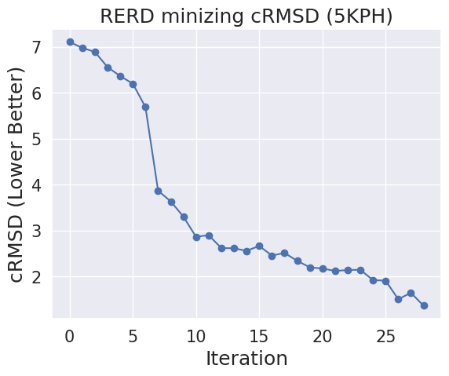

## Description 

This is a code accompanied by a paper in XXX. By combining discrete diffusion models for protein sequences and reward models (i.e., seq -> target property), our method can effectively perform computational protein design. Our approach is summarized as a method that iterates reward-guided generation and noising.  


Here, we show results on optimizing on several fundamental strucutural rewards: ``SS match``, ``cRMSD``, ``globularity``, ``symmetry``. We can also optimize additional functionss such as ``ptm``, ``plddt``, ``hydrophbicity``. All of rewards are defined on top the outputs of seq->strucutre model based on ESMfold. 

#### Generated Proteins 
The examples of generated sequences are visualized as follows (here, we use ESMfold to fold sequecnes).

<div style="display: flex; gap: 20px;">

  <figure style="margin: 0;">
    
    <figcaption style="text-align: center;">Symmetric proteins</figcaption>
  </figure>

  <figure style="margin: 0;">
    
    <figcaption style="text-align: center;">Globularity</figcaption>
  </figure>

  <figure style="margin: 0;">
    
    <figcaption style="text-align: center;">cRMSD</figcaption>
  </figure>

  <figure style="margin: 0;">
    
    <figcaption style="text-align: center;">ss-match</figcaption>
  </figure>


</div>

#### Iteration Curve 

The effectivenss of the iteration is seen as follows. 

<div style="display: flex; gap: 20px;">

  <figure style="margin: 0;">
    
    <figcaption style="text-align: center;">XXX</figcaption>
  </figure>

  <figure style="margin: 0;">
    
    <figcaption style="text-align: center;">XXXX</figcaption>
  </figure>

</div>

----

## How to run the code. 

```
CUDA_VISIBLE_DEVICES=0 python refinement.py
```
with several flags. The following is an expanation of options. 

* ``--decoding``: decoding method e.g., SVDD_edit (our proposal), SVDD (single-shot generation)
* ``--repeatnum``: batch size. This is the beam size of the tree in SVDD. 
* ``--duplicate``: important hyperparameter in decoding methods. It reflects how many states we replicate. This is the width of the tree.  
* ``--metrics_name``: reward functions e.g., ``match_ss``, ``crmsd``, ``tm``, ``globularity``, ``plddt``, ``ptm``, ``hydrophobic``, ``symmetry``
* ``--metrics_list``: how to set weights for the above rewards. e.g., ``--metric_name match_ss,crmsd,plddt --metrics_list 1,1,1`` means we optimize ``match_ss + crmsd + plddt``. 
* ``--proteinname``: In tasks such as ``match_ss``, ``crmsd``, ``tm``, we can set some target structure names in a pdb format in the folder ``/datasets`` (e.g., 5KPH, XX:run1_0367_0004, etc.) 
* ``--iteraiton``: number of iterations in our proposal 
* ``--seq_length``: length of proteins we want to design 
*  ``--edit_seqlength``: How much portion of the sequence we edit   


#### 1. Symmetricity 

Design symmetric proteins with 7 folds. 

```
CUDA_VISIBLE_DEVICES=3 python refinement.py --decoding SVDD_edit  --repeatnum 10 --duplicate 20 --seq_length 30 --metrics_name symmetry,hydrophobic,plddt --metrics_list 1,1,1 --iteration 20 --num_symmetry 7
```

#### 2. Globularity 

Design globular proteins. 

```
CUDA_VISIBLE_DEVICES=2 python refinement.py --decoding SVDD_edit  --repeatnum 10 --duplicate 20  --metrics_name globularity,plddt  --metrics_list 1,1 --iteration 20 --seq_length 150
```

#### 3. cRMSD 

Design a sequence that fold into the certain structure. 

```
CUDA_VISIBLE_DEVICES=3 python refinement.py --decoding SVDD_edit  --repeatnum 20 --duplicate 20  --metrics_name crmsd  --metrics_list 1 --proteinname 5KPH --iteration 40
```

#### 4. SS (secondary structure) match
```
CUDA_VISIBLE_DEVICES=4 python refinement.py --decoding SVDD_edit  --repeatnum 10 --duplicate 20  --metrics_name match_ss  --metrics_list 1 --proteinname r15_96_TrROS_Hall --iteration 30
```

#### 5. TM score 

```
CUDA_VISIBLE_DEVICES=5 python refinement.py --decoding SVDD_edit  --repeatnum 10 --duplicate 20  --metrics_name tm  --metrics_list 1 --proteinname 5KPH --iteration 30
```

----

### Editting Sequences 

When we want to edit existing sequences, set ``--seed_design`` as ``True``, and ``--initial_seq`` as a protein sequence. The following is an example when optimizing symmetry. 

```
CUDA_VISIBLE_DEVICES=6 python refinement.py --decoding SVDD_edit  --repeatnum 10 --duplicate 20 --metrics_name crmsd,plddt,hydrophobic --proteinname r15_96_TrROS_Hall --metrics_list 1,1,1 --iteration 20 --seed_design True --initial_seq MMELEIEIKVEGMTEEELRELAERLAAELTPEGWKVVAVRVERVDEEEGVVRVTVVVEPV  
```

### Outputs 

Refer to the notebook ```medias/evaluate.ipynb```. We save the pdb files of batches in each iteration. 

----

### Installation 

Install pytroch, pyrosseta 

```
conda create -n RERD python=3.9 
conda activate RERD
pip3 install torch torchvision torchaudio
pip3 install -r requirements.txt
```
-----------

### Acknolwdgements 

Our codebase is hevily based on evodiff, openfold, ESM. 

--------------------


